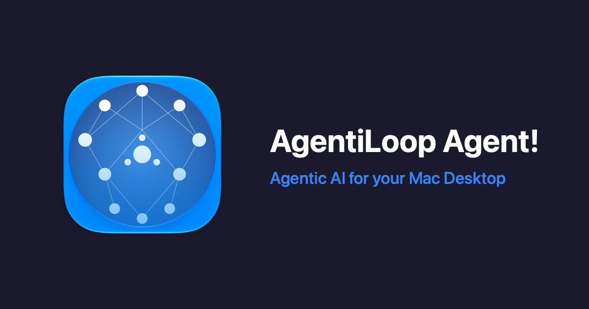

# 🦾 agentiloop.ai — the home of AgentiLoop Agent!

**Live site: [agentiloop.ai](https://agentiloop.ai/)** · **App: [AgentiLoop/Agent](https://github.com/AgentiLoop/Agent)** · **Download: [latest release](https://github.com/AgentiLoop/Agent/releases/latest)**



This repo is the source of **agentiloop.ai**, the official website for **AgentiLoop Agent!**. It's hand-written HTML, CSS and vanilla JavaScript. There's no framework, no bundler and no `node_modules`, and it's served as static assets on Cloudflare Workers.

---

## What is Agent!?

**One app. Any AI. Total command over your Mac.**

Agent! is a native Swift / SwiftUI AI agent for macOS. You type (or say) what you want, and it gets it done:

- 🛠 **Codes for real.** Reads your project, edits files, builds in Xcode, fixes the errors and commits with git.
- 🖥 **Drives any Mac app** through the Accessibility API, plus AppleScript, JXA and 51 ScriptingBridge app bridges.
- 📜 **AgentScript.** Swift scripts compiled at runtime and loaded in-process with full TCC permissions.
- 🛡 **Shell as you or as root**, through a Launch Agent and a Launch Daemon (SMAppService + XPC).
- 🤖 **23 LLM providers + Apple Intelligence.** Claude, Codex, OpenAI, Gemini, Grok, Mistral, DeepSeek, Qwen, Z.ai, OpenRouter, Ollama, vLLM, LM Studio and more. Use cloud, local or fully on-device.
- 🎙 **Voice and iMessage.** Say *"Agent!"* or text it from your iPhone.
- 🧩 **MCP**, sub-agents, memory, plans and a Jev safety check before shell commands.

It runs on **macOS 14.6 or later**, on **Apple Silicon and Intel**. A setup wizard gets your provider and model configured on first launch.

```sh
brew update && brew install --cask agentiloop-agent
```

Or grab the signed and notarized `.dmg` from [Releases](https://github.com/AgentiLoop/Agent/releases/latest).

**Prefer the terminal?** The agent loop is also available as cross-platform CLIs for macOS, Windows and Linux, in Rust ([AgentiLoopCLI](https://github.com/AgentiLoop/AgentiLoopCLI)) and Go ([AgentiLoopGo](https://github.com/AgentiLoop/AgentiLoopGo)).

---

## What's on the site

| Page | Path | What it is |
|---|---|---|
| Home | [`/`](https://agentiloop.ai/) | Features, providers, reviews, sponsors, releases and contact |
| Setup guide | [`/setup.html`](https://agentiloop.ai/setup.html) | First-run setup walkthrough |
| Download stats | [`/stats.html`](https://agentiloop.ai/stats.html) | Live release download counts from the GitHub API |
| Press kit | [`/press/`](https://agentiloop.ai/press/) | Fact sheet, screenshots, promo banners, icon and a ZIP of everything |
| Blog | [`/blog/`](https://agentiloop.ai/blog/) | Daily posts on Agent! internals, releases and security, with an [RSS feed](https://agentiloop.ai/blog/feed.xml) |
| Legal | [`/legal.html`](https://agentiloop.ai/legal.html) | Trademark notice, licenses and warranty disclaimer |
| Fully Automated | [`/auto.html`](https://agentiloop.ai/auto.html) | A poem |
| TickyTacky | [`/tickytacky/`](https://agentiloop.ai/tickytacky/) | Neon tic-tac-toe, just for fun |

The home, legal, stats, press and blog pages are translated into 🇪🇸 Español, 🇫🇷 Français, 🇩🇪 Deutsch, 🇨🇳 中文, 🇷🇺 Русский, 🇰🇷 한국어 and 🇯🇵 日本語, under `/<lang>/`.

## Repo layout

```
index.html  setup.html  stats.html  legal.html  auto.html   pages
styles.css  nav.css  footer.css  promo.css  stats.css       styles
script.js  nav.js  promo.js  version.js                     scripts (version.js = current app version)
press/                                                      press kit page + downloadable assets
blog/                                                       blog: src/*.md posts -> tools/build.py -> generated pages + feed.xml
sponsors/                                                   sponsor logos, ads and tier badges
tickytacky/                                                 the tic-tac-toe game
i18n/                                                       translation tooling + <lang>.json strings (not published)
de/ es/ fr/ ja/ ko/ ru/ zh/                                 generated translated pages (don't edit by hand)
wrangler.jsonc  .assetsignore                               Cloudflare Workers config + publish exclusions
```

## Running it locally

It's a static site, so any file server works:

```sh
python3 -m http.server 8000
# open http://localhost:8000
```

## Translations

English pages are the single source of truth. The `/<lang>/` copies are generated from them:

```sh
python3 i18n/i18n.py extract   # writes i18n/strings.json (English strings to translate)
# translate new/changed strings in i18n/<lang>.json
python3 i18n/i18n.py build     # regenerates /<lang>/... pages
```

Missing translations fall back to English. Edit the English page first, then extract and build. Don't edit the generated pages directly.

## Blog

Posts are Markdown files in `blog/src/`, named `YYYY-MM-DD-slug.md`, with a front-matter block:

```md
---
title: Post title
description: One-sentence summary (meta tags, index card and RSS)
tags: Internals, Security
---
Post body in Markdown…
```

Then run:

```sh
python3 blog/tools/build.py   # writes blog/<slug>/index.html, blog/index.html, blog/feed.xml and the blog block in sitemap.xml
```

Posts dated after today are skipped, so you can queue a week of posts and publish one a day just by rebuilding. Don't edit the generated pages by hand.

The blog is localized like the rest of the site. Translations use the same filename under `blog/src/<lang>/` (es, fr, de, zh, ru, ko, ja) and are built to `/<lang>/blog/`, with the same language picker as the main page. Blog UI strings live in `blog/tools/i18n.json`, and nav and footer labels come from `i18n/<lang>.json`. A post without a translation falls back to English with a short note.

## Deploying

Cloudflare Workers serves the repo root as static assets (see `wrangler.jsonc`). Anything listed in `.assetsignore` stays in the repo but isn't published. That includes the i18n tooling, press-kit build tools, `.git` and local agent state.

## The Agent! family

| Repo | What it is |
|---|---|
| [Agent](https://github.com/AgentiLoop/Agent) | The Mac app |
| [AgentiLoopCLI](https://github.com/AgentiLoop/AgentiLoopCLI) · [AgentiLoopGo](https://github.com/AgentiLoop/AgentiLoopGo) | Cross-platform agent loop CLIs (Rust · Go) |
| [AgentScripts](https://github.com/AgentiLoop/AgentScripts) | Swift scripts that run inside Agent! |
| [AgentTools](https://github.com/AgentiLoop/AgentTools) · [AgentLLM](https://github.com/AgentiLoop/AgentLLM) · [AgentMCP](https://github.com/AgentiLoop/AgentMCP) | Tool schemas and prompts · LLM provider framework · MCP client |
| [AgentAccess](https://github.com/AgentiLoop/AgentAccess) · [AgentEventBridges](https://github.com/AgentiLoop/AgentEventBridges) | Accessibility automation · ScriptingBridge app bridges |
| [AgentD1F](https://github.com/AgentiLoop/AgentD1F) · [AgentSwift](https://github.com/AgentiLoop/AgentSwift) | Multi-line diff engine · SwiftSyntax code analysis |
| [AgentColorSyntax](https://github.com/AgentiLoop/AgentColorSyntax) · [AgentTerminalNeo](https://github.com/AgentiLoop/AgentTerminalNeo) · [AgentAudit](https://github.com/AgentiLoop/AgentAudit) | Syntax highlighting · retro terminal markdown · audit logging |

## Contributing

Found a typo, a broken link or a bad translation? Issues and pull requests are welcome. For the app itself, head to [AgentiLoop/Agent/issues](https://github.com/AgentiLoop/Agent/issues).

## License

Website source: [MIT](LICENSE). "AgentiLoop Agent!" and the Agent! logo are trademarks of AgentiLoop.ai, a Logos InkPen LLC company. See [legal.html](https://agentiloop.ai/legal.html).

---

Copyright © 2026 AgentiLoop.ai, a Logos InkPen LLC company. All rights reserved.
